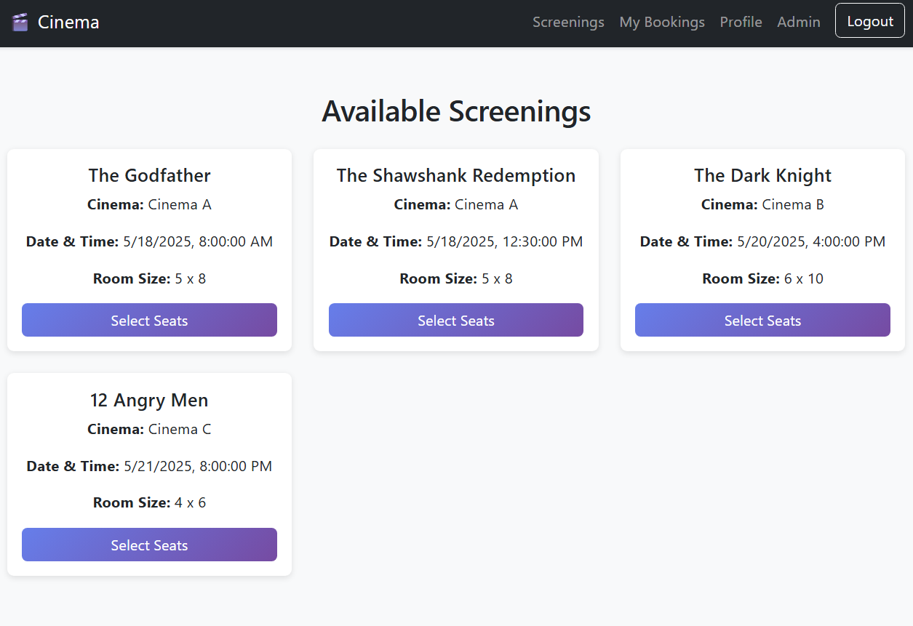
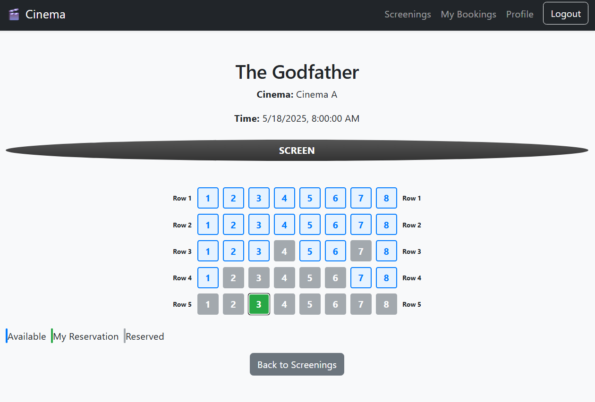
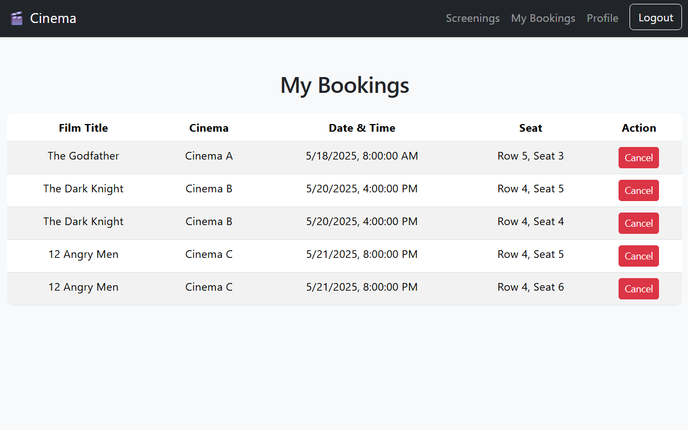
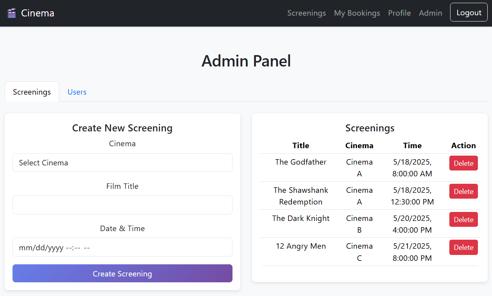
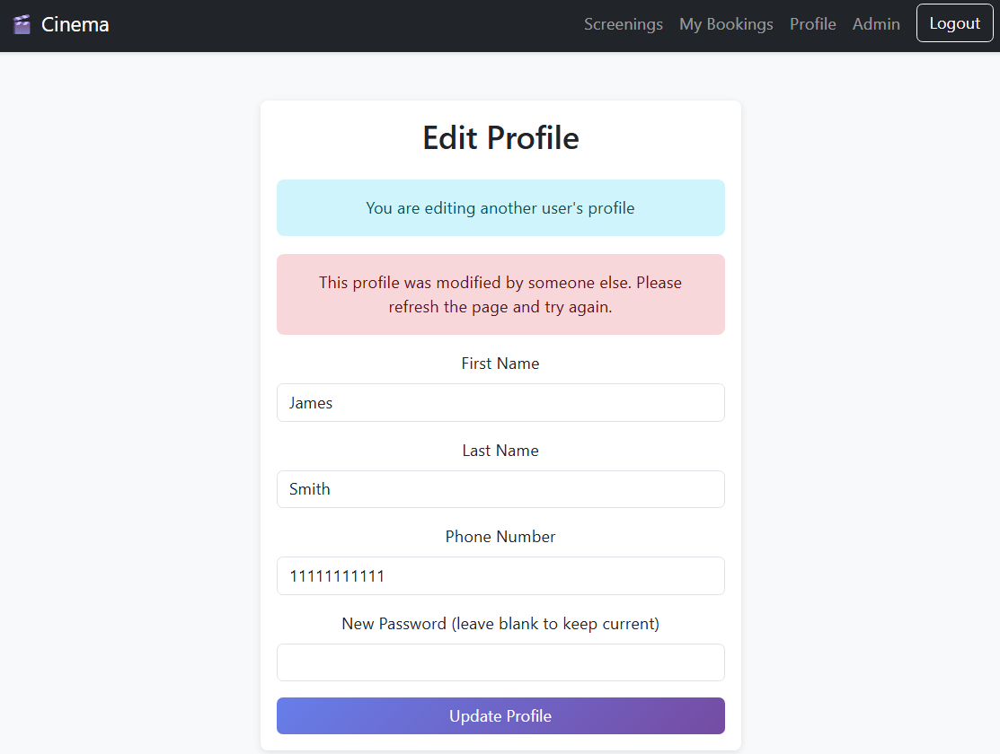

# Cinema Ticket System

A full-stack cinema reservation system built with ASP.NET Core and React. The application provides user registration and profile management, cinema screening management, interactive seat reservations, booking history, and concurrency-safe seat booking and user editing.

## Features

### User

* User registration and login
* Profile management
* Browse available cinema screenings
* View seat availability for a selected screening
* Reserve and release seats
* View personal bookings
* Cancel reservations

### Administrator

* Manage users
* Edit user information
* Create cinema screenings
* Delete cinema screenings
* Assign screenings to cinemas
* Manage screening dates and times

### Seat Reservation

The application supports interactive seat selection based on the auditorium layout of the selected cinema.

Seat reservations are protected against concurrent booking attempts. The database enforces uniqueness for each combination of screening, row, and seat, preventing the same seat from being reserved twice. The API handles a conflicting reservation by returning `409 Conflict`.

## Screenshots

### Screenings



### Seat Selection



### My Bookings



### Admin Panel



### Concurrency Conflict



## Tech Stack

### Backend

* C#
* ASP.NET Core Web API
* Entity Framework Core
* MySQL
* BCrypt.Net
* ASP.NET Core Session

### Frontend

* React
* TypeScript
* Vite
* React Router
* Axios
* Bootstrap

## Architecture

The application is split into a backend API and a React single-page application.

```text
                   React SPA
                       |
                 HTTP / REST API
                       |
                       v
                ASP.NET Core API
                       |
              Entity Framework Core
                       |
                       v
                     MySQL
```

### Backend

```text
ReactMovie.Server/
├── Controllers/
├── DTOs/
├── Data/
├── Models/
├── Properties/
└── Program.cs
```

The backend exposes REST endpoints through ASP.NET Core controllers. Entity Framework Core is used for database access and relationship management.

### Frontend

```text
ReactMovie.client/
├── public/
└── src/
    ├── assets/
    ├── components/
    ├── contexts/
    ├── services/
    ├── types/
    ├── App.tsx
    └── main.tsx
```

The frontend is implemented as a React single-page application. API communication is handled through Axios, while React Router is used for client-side navigation.

## Database

The application uses MySQL with Entity Framework Core.

The main entities are:

```text
ApplicationUser
Cinema
Screening
Reservation
```

The relationships can be summarized as:

```text
ApplicationUser
      |
      | 1..*
      v
Reservation
      |
      | *..1
      v
Screening
      |
      | *..1
      v
Cinema
```

Each cinema has a rectangular auditorium defined by its number of rows and seats per row. Screenings are associated with a cinema, and reservations are associated with both a screening and a user.

## Concurrency Handling

Concurrent seat reservation is one of the main technical aspects of the project.
It uses database-level concurrency controls for both seat reservations and user account editing.

### Seat Reservations
Before creating a reservation, the API checks whether the seat is already reserved. However, this check alone is not sufficient when multiple requests arrive at nearly the same time.

To provide a database-level guarantee, reservations have a unique constraint on:

```text
(ScreeningId, Row, Seat)
```

This ensures that only one reservation can exist for a specific seat within a specific screening.

When a concurrent request attempts to reserve an already-claimed seat, the database rejects the duplicate entry. The API catches the resulting database update exception and returns:

```http
409 Conflict
```

This prevents concurrent users from successfully reserving the same seat.

### User Editing

User profile editing uses Entity Framework Core's optimistic concurrency mechanism with a `RowVersion` concurrency token.

The `ApplicationUser` entity contains a `[Timestamp]` `RowVersion` property. When user data is returned by the API, the current row version is also returned to the frontend.

When a user submits an edit, the frontend sends the row version that was originally loaded. The API sets this value as the original concurrency value before saving the changes.

If another user or administrator has modified the same account in the meantime, the row version in the database no longer matches the submitted version. Entity Framework Core then raises a `DbUpdateConcurrencyException`.

The API catches this exception and returns:

```http
409 Conflict
```

with a message indicating that the user was modified by another process and that the data should be refreshed before trying again.

This prevents one user's outdated changes from silently overwriting newer changes made by another user.

## Authentication

The application uses ASP.NET Core session-based authentication.

User passwords are hashed using BCrypt rather than being stored as plaintext.

The frontend keeps track of the authenticated user through React state/context and communicates with the backend through the API layer.

## Getting Started

### Prerequisites

Install the following before running the application:

* .NET SDK
* Node.js and npm
* MySQL
* Visual Studio or another compatible .NET IDE

### 1. Clone the repository

```bash
git clone https://github.com/markztmr/cinema-ticket-system-react.git
cd cinema-ticket-system-react
```

### 2. Create the database

Create a MySQL database named:

```text
CinemaDb
```

Configure the backend connection string for your local MySQL installation.

The project currently uses a local MySQL connection configured in `Program.cs`, for example:

```text
Server=localhost;
Port=3306;
Database=CinemaDb;
Uid=root;
Pwd=;
```

Change the connection details to match your local environment.

### 3. Install frontend dependencies

```bash
cd ReactMovie.client
npm install
```

### 4. Run the application

Open `ReactMovie.slnx` in Visual Studio and start the ASP.NET Core project.

The ASP.NET Core application is configured to serve the React application as part of the same application.

For frontend development, the React project can also be started separately with:

```bash
cd ReactMovie.client
npm run dev
```

## Project Structure

```text
cinema-ticket-system-react/
│
├── ReactMovie.Server/
│   ├── Controllers/
│   ├── DTOs/
│   ├── Data/
│   ├── Models/
│   ├── Properties/
│   ├── Program.cs
│   ├── appsettings.json
│   └── ReactMovie.Server.csproj
│
├── ReactMovie.client/
│   ├── public/
│   ├── src/
│   │   ├── assets/
│   │   ├── components/
│   │   ├── contexts/
│   │   ├── services/
│   │   └── types/
│   ├── package.json
│   ├── vite.config.ts
│   └── ReactMovie.client.esproj
│
├── .gitignore
├── LICENSE
└── ReactMovie.slnx
```

## Project Background

This project is a React-based reimplementation of an earlier cinema reservation system built with ASP.NET MVC.

The first implementation used a more traditional server-rendered approach. This version separates the frontend and backend responsibilities by using a React single-page application together with an ASP.NET Core API.

The project was developed as a university assignment covering user management, cinema and screening management, database access with Entity Framework, seat reservation, concurrency handling, and production preparation.

## License

This project is licensed under the MIT License.
